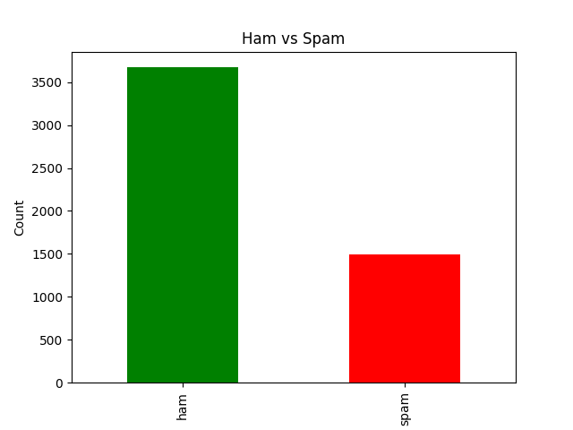
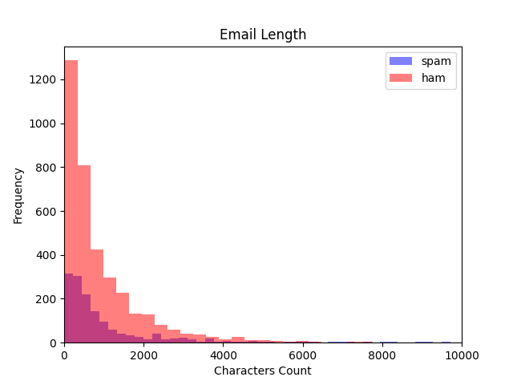

# Spam-Email-Classification
A beginner-friendly Python project to analyze and visualize a labeled email dataset. The goal is to classify the emails in spam and ham (non-spam) messages using basic statistics and plots.

## 🎯 Project Objective

To explore and visualize a dataset of emails labeled as **spam** or **ham**, and gain insights into:

- The distribution of spam vs ham messages
- Differences in average email lengths
- Visual trends that could help in building a future spam classifier

## 🧠 Outcome

- 📊 **Bar chart** comparing the number of spam and ham emails
- 📈 **Histogram** comparing the length distribution of spam vs ham emails
- 📄 Summary table showing counts and percentages
- 🧩 Dataset prepped for further machine learning modeling

## 📊 Visualizations

### 1. 📋 Spam vs Ham Count (Bar Chart)

> Green: Ham emails, Red: Spam emails  
> Helps visualize the balance between classes.

### 2. 📏 Email Length Distribution (Histogram)

> Compares the number of characters in spam and ham emails.  
> Useful for understanding content length differences.

Thanks!
